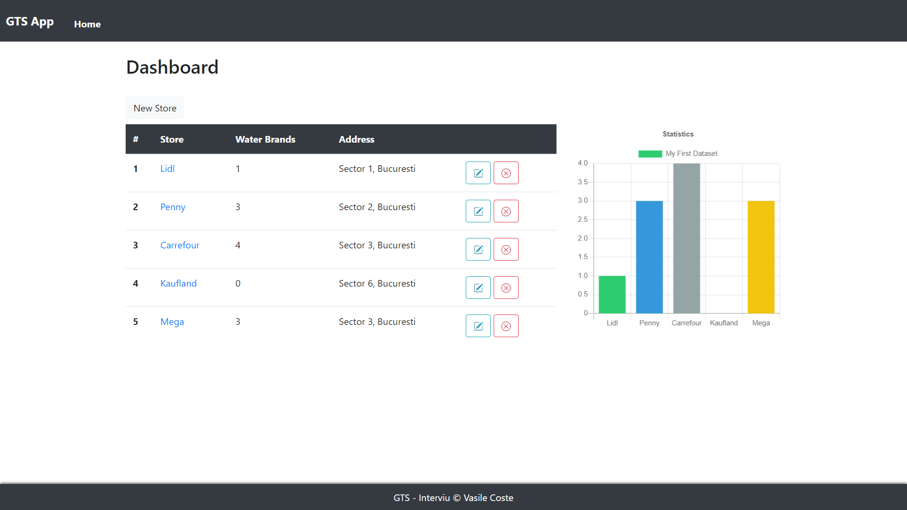
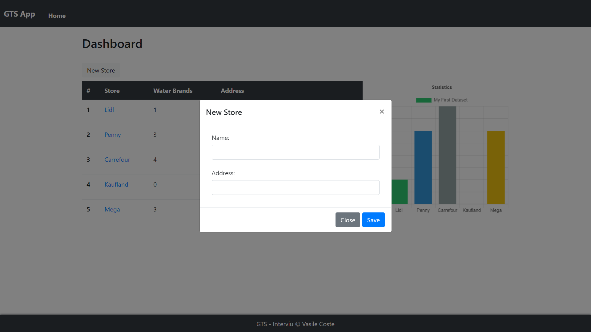
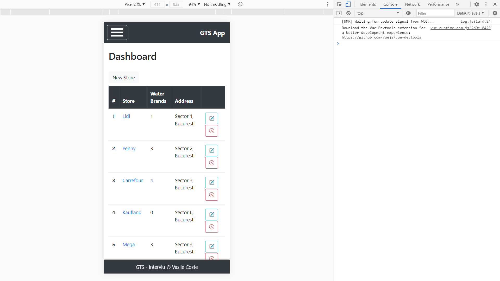
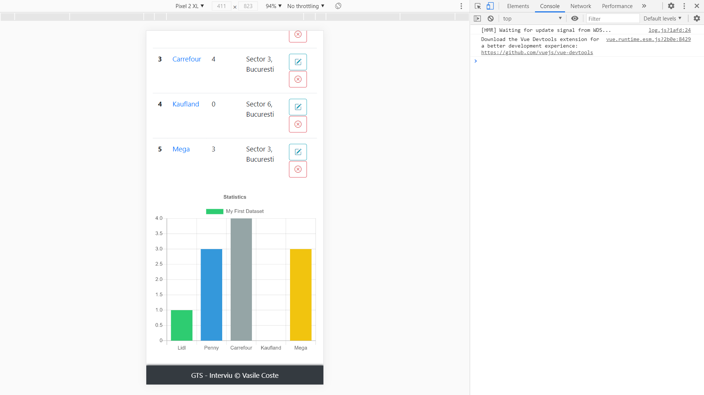
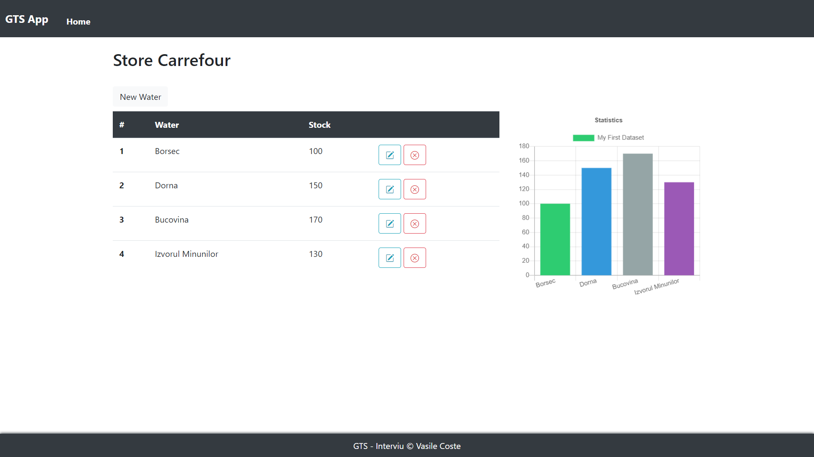
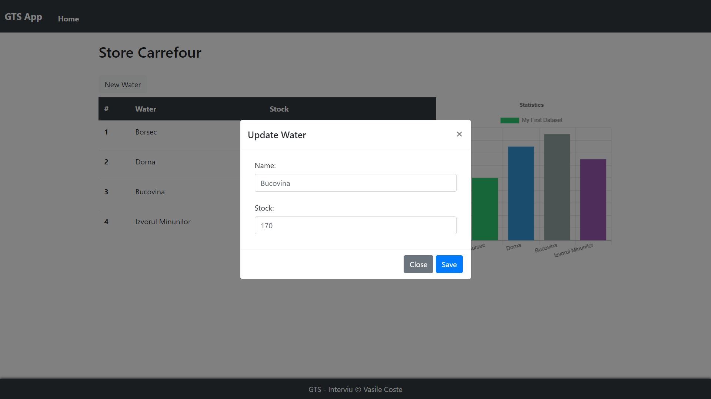
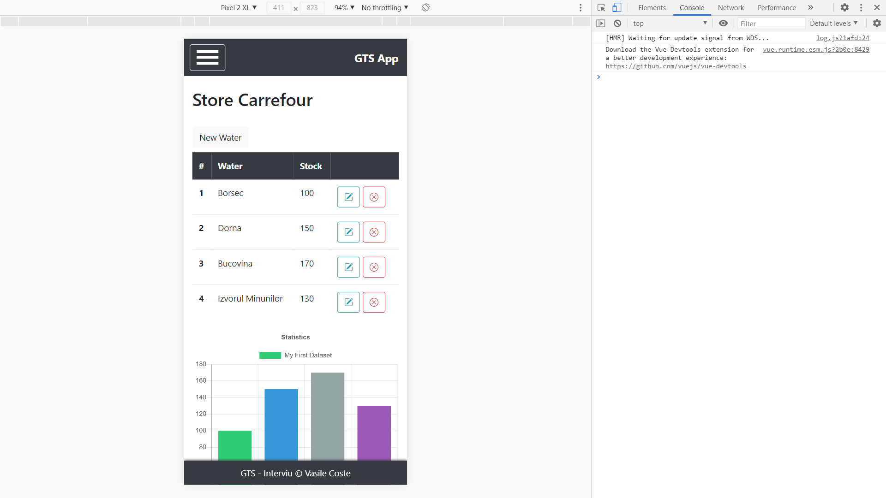
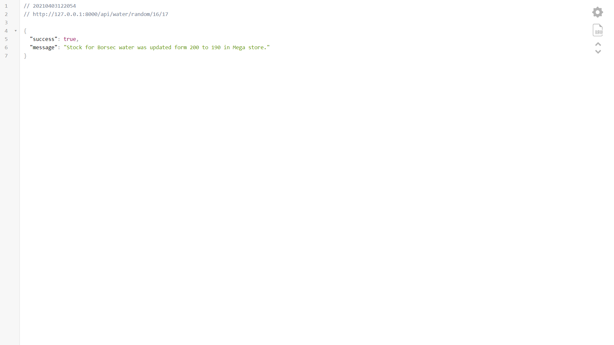

# Simple App for GTS interview

## Short Description:
SPA (Single Page App) for viewing water stock from stores.

## Requirements:
- add / delete stores using the UI
- update from backend water stock of a store -> this will be random made depending on the hour day
- view the stock in a friendly UI

## Nice to have:
- charts
- tables
- icons

## `App Specs`
- API was build using Laravel v8
    - the DB chosen for this project is MySQL and was created using migration
- App was build using VueJS v2. Pugin that were used in this project:
    - vuex
    - vue-router
    - vue-notification
    - axios
    - bootstrap, jquery, popper.js and bootstrap-icons
    - chart.js

## `App Screenshots`

<table style="padding:10px">
	<tr><td colspan="2"><b>Home</b></td></tr>
	<tr>
		<td></td>
		<td></td>
	</tr>
	<tr>
		<td></td>
		<td></td>
	</tr>
	<tr><td colspan="2"><b>Store</b></td></tr>
	<tr>
		<td></td>
		<td></td>
	</tr>
	<tr>
		<td></td>
		<td></td>
	</tr>
	<tr><td colspan="2"><b>API - random stock update</b></td></tr>
	<tr>
		<td></td>
		<td></td>
	</tr>
</table>
